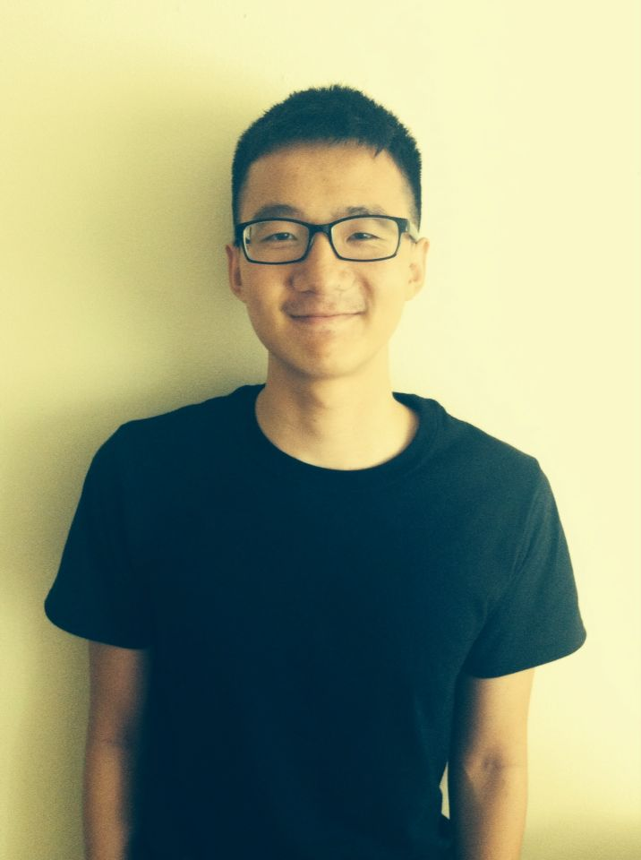

## WEEK-ONE

### What are your expectations of the class? 

Walking into the junior year, I find myself eager to take as much CS courses as possible. I know I'm struggling with *POINTERS*, so diving into C/C++ seems to be the challenge that I need to overcome. People say you have to take at least one course by Professor Downing before getting a CS degree — here it goes. I also expect to learn some practical skills to prepare for the upcoming interviews, and signing up for this course definitely helps.

### What did you do this past week?

Stay warm at home and watch out for the freezing weather. Just kidding! I attended several lectures to grasp what's going on, finalized the schedule for this semester and planned my degree progress. That's pretty much the same as everyone else.  

### What's in your way?

A lot of pressure. Why so many posts mentioned 439? Other than this course, I'm taking CS439 and CS345 as well. I'm not insane; I just love going against general advice to see what sort of journey it would be. For me, being busy is the only way to avoid slacking off. I don't like implementing operating system at all, but I think topics like using Haskell to write a interperter for JavaScript and taking LIVE programming test as exams should be so exciting!

### What will you do next week?

I will be working on the very first project in 439, since I just can't wait to see how horrible it could be. Also, I will get in touch with more classmates to suffer this semester together. Hopefully I will still have time to catch up with other courses and having fun a little bit. Anyway, I'm so ready to get along with these time-consuming courses.

### What's my experience of the class?

Fantastic. Professor Downing mentioned the word "interview" a lot in class, and everytime it thrills me to switch on the work mode. Class notes are also available on github, so that we can always keep track of any materials in case it comes up. The lecture was fairly easy to follow. We went over Docker briefly, a little bit c++ basics and the usage of assertions. I used to make tests using assertion, and I was not able to judge other cases if the assertion stucks at one place. This is one of the very few experiences that I found the lecture could be so practical and close to real-life programming experience instead of theories, so I liked it a lot.  

### What's my pick-of-the-week or tip-of-the-week?

I will give it to Docker. I remember once I was asked whether I have any experience of Docker in a phone interview, and that really freaks me out. I don't really know much about it, even though I ran into the term Docker a lot when googling staff. Unfortunately I got rejected in that interview, and I wish I had taken this course.

